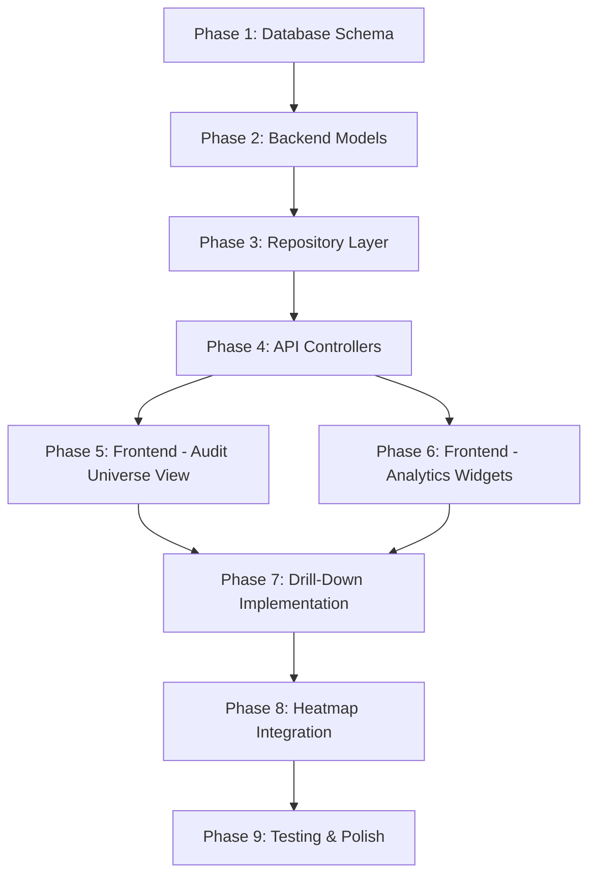

# Enterprise-Grade Analytical Reports & Audit Universe Hierarchy

## Executive Summary

This plan transforms the Risk Assessment Framework into a world-class audit analytics platform rivaling SAP, Oracle GRC, and other enterprise audit tools. The enhancements include:

1. **Audit Universe Hierarchy Management** - Full CRUD dashboard for managing audit entities with parent-child relationships
2. **Drill-Down Analytics** - Click any chart element to explore deeper levels of data
3. **Advanced Analytical Widgets** - 8 new premium widgets for comprehensive audit insights
4. **Heatmap Integration** - Embed the existing heatmap with drill-down capabilities
5. **Trend Analysis & Risk Velocity** - Track how risks evolve over time

---

## User Review Required

> [!IMPORTANT]
> **Database Changes Required**: This implementation adds 5 new tables to the database. Please confirm you're ready to run the migration scripts.

> [!WARNING]  
> **Breaking Change**: The analytical dashboard will be significantly restructured. Existing custom layout preferences will need to be reset.

---

## Current State Analysis

### Existing Components
- **Analytical Dashboard**: Widget-based dashboard with customizable layouts
- **Widgets**: InherentVsResidual, RiskCategoryDistribution, ControlCoverage, MarketRisk, TopRisks
- **Heatmap**: Fully implemented with Likelihood vs Impact grid (separate view)
- **Departments/Projects**: Basic CRUD with API integration
- **Risk Assessments**: Full assessment management with references

### What's Missing
- No audit universe hierarchy for organizing auditable entities
- No drill-down from charts to detailed data
- No findings/recommendations tracking
- No trend analysis over time
- No audit coverage visualization
- Heatmap is separate from the analytical dashboard

---

## Proposed Changes

### Database Schema

#### [NEW] audit_universe.sql
```sql
-- Audit Universe: Hierarchical structure for auditable entities
CREATE TABLE audit_universe (
    id SERIAL PRIMARY KEY,
    name VARCHAR(255) NOT NULL,
    code VARCHAR(50) UNIQUE NOT NULL,
    parent_id INTEGER REFERENCES audit_universe(id) ON DELETE SET NULL,
    level INTEGER NOT NULL DEFAULT 1, -- 1=Entity, 2=Division, 3=Process, 4=Sub-Process
    level_name VARCHAR(100), -- e.g., "Entity", "Division", "Business Process"
    description TEXT,
    risk_rating VARCHAR(20) DEFAULT 'Medium', -- High, Medium, Low
    last_audit_date DATE,
    next_audit_date DATE,
    audit_frequency_months INTEGER DEFAULT 12,
    owner VARCHAR(255),
    is_active BOOLEAN DEFAULT TRUE,
    created_at TIMESTAMP DEFAULT CURRENT_TIMESTAMP,
    updated_at TIMESTAMP DEFAULT CURRENT_TIMESTAMP
);

-- Link audit universe nodes to departments
CREATE TABLE audit_universe_department_link (
    id SERIAL PRIMARY KEY,
    audit_universe_id INTEGER NOT NULL REFERENCES audit_universe(id) ON DELETE CASCADE,
    department_id INTEGER NOT NULL REFERENCES departments(id) ON DELETE CASCADE,
    created_at TIMESTAMP DEFAULT CURRENT_TIMESTAMP,
    UNIQUE(audit_universe_id, department_id)
);

-- Audit Findings for comprehensive tracking
CREATE TABLE audit_findings (
    id SERIAL PRIMARY KEY,
    reference_id INTEGER REFERENCES riskassessmentreference(reference_id),
    audit_universe_id INTEGER REFERENCES audit_universe(id),
    finding_title VARCHAR(500) NOT NULL,
    finding_description TEXT,
    severity VARCHAR(20) NOT NULL DEFAULT 'Medium', -- Critical, High, Medium, Low
    status VARCHAR(30) NOT NULL DEFAULT 'Open', -- Open, In Progress, Closed, Overdue
    identified_date DATE NOT NULL DEFAULT CURRENT_DATE,
    due_date DATE,
    closed_date DATE,
    assigned_to VARCHAR(255),
    root_cause TEXT,
    created_at TIMESTAMP DEFAULT CURRENT_TIMESTAMP,
    updated_at TIMESTAMP DEFAULT CURRENT_TIMESTAMP
);

-- Recommendations/Action Plans
CREATE TABLE audit_recommendations (
    id SERIAL PRIMARY KEY,
    finding_id INTEGER NOT NULL REFERENCES audit_findings(id) ON DELETE CASCADE,
    recommendation TEXT NOT NULL,
    management_response TEXT,
    agreed_date DATE,
    implementation_date DATE,
    responsible_person VARCHAR(255),
    status VARCHAR(30) DEFAULT 'Pending', -- Pending, Agreed, Implemented, Rejected
    created_at TIMESTAMP DEFAULT CURRENT_TIMESTAMP,
    updated_at TIMESTAMP DEFAULT CURRENT_TIMESTAMP
);

-- Audit Coverage Tracking
CREATE TABLE audit_coverage (
    id SERIAL PRIMARY KEY,
    audit_universe_id INTEGER NOT NULL REFERENCES audit_universe(id) ON DELETE CASCADE,
    period_year INTEGER NOT NULL,
    period_quarter INTEGER, -- 1-4 or NULL for annual
    planned_audits INTEGER DEFAULT 0,
    completed_audits INTEGER DEFAULT 0,
    coverage_percentage DECIMAL(5,2) GENERATED ALWAYS AS (
        CASE WHEN planned_audits > 0 
             THEN (completed_audits::DECIMAL / planned_audits * 100)
             ELSE 0 
        END
    ) STORED,
    notes TEXT,
    created_at TIMESTAMP DEFAULT CURRENT_TIMESTAMP,
    UNIQUE(audit_universe_id, period_year, period_quarter)
);
```

---

### Backend API Enhancements

#### [NEW] Model/Auditing/AuditUniverse/AuditUniverseNode.cs

New model classes for audit universe hierarchy, findings, and recommendations.

#### [NEW] Repository/Auditing/AuditUniverseRepository.cs

Repository with methods:
- `GetHierarchyAsync()` - Returns full tree structure
- `GetNodeWithChildrenAsync(id)` - Get node with immediate children
- `GetNodeAsync(id)` - Get single node
- `CreateNodeAsync(node)` - Create new node
- `UpdateNodeAsync(node)` - Update existing node
- `DeleteNodeAsync(id)` - Delete node (reparent children)
- `LinkDepartmentAsync(nodeId, deptId)` - Link department
- `UnlinkDepartmentAsync(nodeId, deptId)` - Unlink department
- `GetLinkedDepartmentsAsync(nodeId)` - Get linked departments

#### [NEW] Controllers/AuditUniverseController.cs

RESTful endpoints:
```
GET    /api/v1/AuditUniverse/GetHierarchy
GET    /api/v1/AuditUniverse/GetNode/{id}
POST   /api/v1/AuditUniverse/CreateNode
PUT    /api/v1/AuditUniverse/UpdateNode/{id}
DELETE /api/v1/AuditUniverse/DeleteNode/{id}
POST   /api/v1/AuditUniverse/LinkDepartment
DELETE /api/v1/AuditUniverse/UnlinkDepartment
GET    /api/v1/AuditUniverse/GetLinkedDepartments/{nodeId}
```

#### [MODIFY] Controllers/RiskGraphsController.cs

Enhanced endpoints for drill-down analytics:
```
GET /api/v1/RiskGraphs/GetDrillDown?type={chartType}&level={nodeId}&filter={filterJson}
GET /api/v1/RiskGraphs/GetFindingsAging?referenceId={id}&universeId={nodeId}
GET /api/v1/RiskGraphs/GetAuditCoverageMap?year={year}
GET /api/v1/RiskGraphs/GetRiskTrend?referenceId={id}&months={count}
GET /api/v1/RiskGraphs/GetRiskVelocity?referenceId={id}
```

---

### Frontend Components

#### [NEW] views/audit_universe/audit_universe_view.py

A comprehensive dashboard for managing the audit universe hierarchy:

**Features:**
- **Tree View**: Interactive tree visualization of the hierarchy
- **CRUD Operations**: Add/Edit/Delete nodes via modal dialogs
- **Drag & Drop**: Reorganize hierarchy (reparenting)
- **Department Linking**: Multi-select departments to link/unlink
- **Risk Indicators**: Visual risk level badges
- **Coverage Metrics**: Show last audit date and coverage %
- **Search/Filter**: Search nodes by name/code

**UI Layout:**
```
┌──────────────────────────────────────────────────────────────┐
│ Audit Universe Management                    [+ Add Node]    │
├─────────────────────────┬────────────────────────────────────┤
│                         │                                    │
│  🏢 Corporate (Entity)  │  Node Details Panel                │
│   ├─ 🏭 Operations      │  ┌──────────────────────────────┐  │
│   │   ├─ Supply Chain   │  │ Name: Operations Division    │  │
│   │   └─ Manufacturing  │  │ Code: OPS-001                │  │
│   ├─ 💰 Finance         │  │ Risk Rating: [High] 🔴       │  │
│   │   ├─ Treasury       │  │ Last Audit: 2025-06-15       │  │
│   │   └─ Accounting     │  │ Next Audit: 2026-06-15       │  │
│   └─ 🖥️ Technology      │  │                              │  │
│       ├─ Infrastructure │  │ Linked Departments:          │  │
│       └─ Development    │  │ ☑ IT Department              │  │
│                         │  │ ☑ Operations                 │  │
│                         │  │ ☐ Finance (click to link)    │  │
│                         │  │                              │  │
│                         │  │ [Edit] [Delete] [View Risks] │  │
│                         │  └──────────────────────────────┘  │
└─────────────────────────┴────────────────────────────────────┘
```

#### [NEW] views/widgets/findings_aging_widget.py

**Open Findings Aging Analysis**

Displays a horizontal stacked bar chart showing:
- Y-axis: Finding severity (Critical, High, Medium, Low)
- X-axis: Age buckets (0-30 days, 31-60 days, 61-90 days, 90+ days)
- Click any segment to drill-down to specific findings

#### [NEW] views/widgets/audit_coverage_widget.py

**Audit Coverage Map**

A treemap/sunburst visualization showing:
- Hierarchical view of audit universe
- Color-coded by coverage percentage (Red < 50%, Yellow 50-80%, Green > 80%)
- Size proportional to risk rating
- Click to drill down into sub-hierarchy

#### [NEW] views/widgets/risk_trend_widget.py

**Risk Trend Analysis**

Multi-line chart showing:
- X-axis: Time periods (months/quarters)
- Y-axis: Risk counts or scores
- Lines for each risk level (Critical, High, Medium, Low)
- Trend arrows indicating direction
- Click data point to view assessments from that period

#### [NEW] views/widgets/risk_velocity_widget.py

**Risk Velocity Meter**

Gauge-style visualization showing:
- Speed of risk level changes (improving/worsening)
- Comparison to previous period
- Key metrics: Risks added, Risks closed, Net change
- Trend indicator (accelerating/decelerating)

#### [NEW] views/widgets/department_comparison_widget.py

**Department Risk Comparison**

Comparative analysis:
- Bar chart comparing risk scores across departments
- Radar chart for multi-dimensional comparison
- Sortable by various metrics
- Click department to drill into its risks

#### [NEW] views/widgets/control_effectiveness_widget.py

**Control Effectiveness Dashboard**

Displays:
- Pie chart of control test results (Effective/Partially Effective/Not Effective)
- Timeline of control testing
- Control gap analysis
- Click to view specific control details

#### [NEW] views/widgets/heatmap_embed_widget.py

**Embedded Heatmap Widget**

Integrates existing heatmap as a dashboard widget:
- Compact heatmap grid
- Maintains all functionality
- Click cells to drill into specific risk combinations
- Synchronized with hierarchy filter

#### [MODIFY] views/analytics/analytical_dashboard.py

Enhanced with:

1. **Hierarchy Selector** at top of dashboard:
```python
# Add hierarchy filter dropdown
self.hierarchy_selector = ft.Dropdown(
    label="Audit Universe Filter",
    hint_text="All Levels",
    options=[],  # Populated from API
    on_change=self._on_hierarchy_change
)
```

2. **Updated Widget Registry** with new widgets:
```python
self.widget_registry = {
    # Existing
    "market_risk": {...},
    "inherent_residual": {...},
    "top_risks": {...},
    "risk_categories": {...},
    "control_coverage": {...},
    # New Premium Widgets
    "heatmap_embed": {"class": HeatmapEmbedWidget, "title": "Risk Heatmap", "default": True},
    "findings_aging": {"class": FindingsAgingWidget, "title": "Findings Aging", "default": True},
    "audit_coverage": {"class": AuditCoverageWidget, "title": "Audit Coverage Map", "default": False},
    "risk_trend": {"class": RiskTrendWidget, "title": "Risk Trends", "default": True},
    "risk_velocity": {"class": RiskVelocityWidget, "title": "Risk Velocity", "default": False},
    "dept_comparison": {"class": DepartmentComparisonWidget, "title": "Department Comparison", "default": False},
    "control_effectiveness": {"class": ControlEffectivenessWidget, "title": "Control Effectiveness", "default": False},
}
```

3. **Drill-Down Navigation**:
```python
def _handle_drill_down(self, widget, drill_context):
    """Handle drill-down from any chart"""
    # Open detail panel with filtered data
    detail_panel = DrillDownPanel(
        drill_context=drill_context,
        on_close=self._close_drill_down
    )
    self._show_drill_down_panel(detail_panel)
```

4. **Breadcrumb Trail**:
```
📊 Analytics > Risk Categories > Operational > Technology
[← Back to Categories]
```

#### [MODIFY] main.py

Add navigation entry for Audit Universe:
```python
view_map = {
    0: "dashboard", 
    1: "assessments", 
    2: "heatmap", 
    3: "analytics",
    4: "audit_universe",  # NEW
    5: "departments", 
    6: "projects", 
    7: "users", 
    8: "settings"
}
```

---

## Verification Plan

### Automated Tests

1. **Backend API Tests**:
```bash
# Test audit universe CRUD
dotnet test --filter "AuditUniverseRepositoryTests"

# Test analytics endpoints
dotnet test --filter "RiskGraphsControllerTests"
```

2. **Database Migration Verification**:
```sql
-- Verify all tables created
SELECT table_name FROM information_schema.tables 
WHERE table_schema = 'Risk_Assess_Framework' 
AND table_name IN ('audit_universe', 'audit_findings', 'audit_recommendations', 'audit_coverage');
```

### Manual Verification

1. **Frontend Testing**:
   - Navigate to Audit Universe dashboard
   - Create a 3-level hierarchy
   - Link departments to nodes
   - Verify hierarchy displays correctly

2. **Analytics Testing**:
   - Open analytical dashboard
   - Select hierarchy filter
   - Verify all charts update
   - Click chart elements for drill-down
   - Verify breadcrumb navigation

3. **Heatmap Integration**:
   - Add heatmap widget to dashboard
   - Click heatmap cell
   - Verify drill-down shows filtered risks

---

## Implementation Order



---

## Risk Mitigation

| Risk | Mitigation |
|------|------------|
| Complex hierarchy queries | Use recursive CTEs; add materialized path column if needed |
| Performance with deep drill-down | Implement pagination; cache hierarchy structure |
| Breaking existing workflows | Feature flags for gradual rollout |
| Data migration issues | Create sample data scripts; document manual steps |

---

## Success Criteria

✅ Users can manage a 4+ level audit universe hierarchy  
✅ All charts support drill-down to lower levels  
✅ Heatmap is embedded in analytical dashboard  
✅ 8 new analytical widgets available  
✅ Audit coverage and findings aging visible  
✅ Performance: Dashboard loads in < 3 seconds  
✅ Responsive design works on 1080p+ screens  

